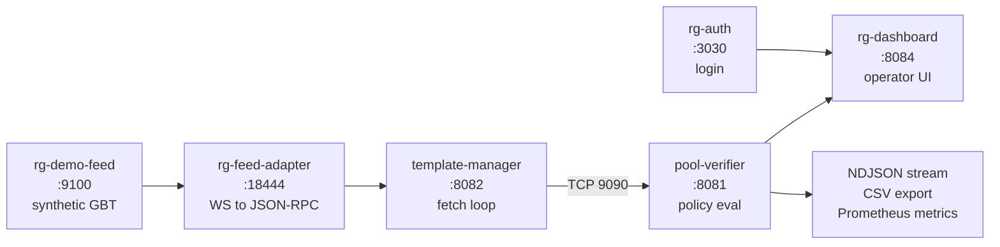

# Shadow Mode End-to-End Walkthrough

Everything shadow mode offers, from nothing to a full running evaluation. Zero real infrastructure. No bitcoind, no miners, no keys. Works on any machine with Docker.

**Target:** first-time evaluator, internal demo rehearsal, customer handoff.
**Time to complete:** 10 minutes start to finish.

---

## Pipeline



Six services. One command to start. 16-scenario loop that hits 5 reject types every 80 seconds.

---

## What You Need

| Item | Shadow mode | Observe | Inline |
|---|---|---|---|
| Docker + Compose | yes | yes | yes |
| `.env` file | minimal | full | full |
| Noise keypair | no | no | yes |
| API secret | no | yes | yes |
| License key | no | yes | yes |
| HMAC secret | no | no | yes |
| bitcoind RPC | no | yes (via rg-feed-server) | yes |

Shadow mode is intentionally key-free. You can be running verdicts in 3 minutes. The desktop app will gate dashboard access until the shadow feed services (`rg-demo-feed` and `rg-feed-adapter`) are confirmed healthy, preventing silent degradation to inline mode if the shadow stack is not running.

---

## Step 1. Clone and Configure

```bash
git clone https://github.com/LeavesJ/veldra.git
cd veldra
cp .env.example .env
```

Open `.env`. For shadow mode you can leave every field blank except optionally the admin email. Every secret is gated behind `VELDRA_API_SECRET_OPTIONAL=1` and `VELDRA_SHARE_HMAC_OPTIONAL=1` in the shadow compose file.

```bash
VELDRA_AUTH_ADMIN_EMAIL=you@example.com   # optional, enables signup
```

That's it. No keys, no SMTP, no rpc password.

---

## Step 2. Pick a Policy

```bash
ls config/*.toml
```

```
config/demo-open-policy.toml       # accepts nearly everything (boring)
config/demo-showcase-policy.toml   # TRIGGERS ALL 5 REJECT TYPES (use this)
config/demo-strict-policy.toml     # rejects aggressively
config/policy.toml                 # balanced default
config/policy-strict.toml          # production-grade
```

For a demo, copy showcase over the default:

```bash
cp config/demo-showcase-policy.toml config/policy.toml
```

---

## Step 3. Start the Stack

```bash
docker compose -f docker-compose.shadow.yml up --build
```

First build takes 3 to 5 minutes. Subsequent starts take under 30 seconds.

You will see six services come up in dependency order:

```
rg-demo-feed        healthy in ~5s
rg-feed-adapter     healthy after demo-feed
pool-verifier       healthy in ~10s
template-manager    healthy after verifier + adapter
rg-auth             healthy in ~10s
rg-dashboard        healthy after verifier + manager
```

When all six are healthy, open the dashboard.

---

## Step 4. Port Map

| Port | Service | What lives there |
|---|---|---|
| 8084 | rg-dashboard | **Main operator UI** (open this) |
| 3030 | rg-auth | Login, register, session |
| 8081 | pool-verifier | Stats, verdicts, policy, exports |
| 8082 | template-manager | Template HTTP API |
| 9090 | pool-verifier | TCP channel from template-manager |
| 18444 | rg-feed-adapter | Impersonated bitcoind RPC |
| 9100 | rg-demo-feed | Synthetic GBT WebSocket |

Only 8084 needs to be open in the operator's mind. Everything else is internal plumbing.

---

## Step 5. What Shadow Produces

### 5.1 Live verdict stream

Open `http://localhost:8084`. You land on the verdicts page. Every 5 seconds a new row appears. Over 80 seconds the scenario loop cycles through and five reject types fire:

```
┌────────────────────────────────────────────────────────────────────┐
│ height   status    reason_code                    age   fees(sat)  │
├────────────────────────────────────────────────────────────────────┤
│ 890014   accept    -                              0s    312,450    │
│ 890015   accept    -                              0s    287,900    │
│ 890016   REJECT    avg_fee_below_minimum          0s    10,000     │
│ 890017   accept    -                              0s    305,220    │
│ 890018   REJECT    sigops_budget_exceeded         0s    298,100    │
│ 890019   accept    -                              0s    290,430    │
│ 890020   REJECT    empty_template_rejected        0s    0          │
│ 890021   accept    -                              0s    315,870    │
│ 890022   REJECT    coinbase_value_zero_rejected   0s    301,200    │
│ 890023   accept    -                              0s    289,650    │
│ 890024   REJECT    weight_ratio_exceeded          0s    310,880    │
└────────────────────────────────────────────────────────────────────┘
```

Click any row to see full policy context (what the policy said, what the template had, where the gap is).

### 5.2 NDJSON event stream

Machine-readable verdict log. Every verdict appends one line.

```bash
curl -s http://localhost:8081/verdicts/log | head -2
```

Each line is a full `LoggedVerdict` struct serialized to JSON. 19 fields covering everything the verifier observed:

```json
{"log_id":42,"template_id":1001,"height":890018,"total_fees":287900,"tx_count":1243,"accepted":false,"reason":"sigops budget exceeded","reason_code":"sigops_budget_exceeded","reason_detail":"sigops 82500 exceeds budget 80000","timestamp":1744626045,"min_avg_fee_used":2000,"fee_tier":"mid","tier_source":"measured","avg_fee_sats_per_tx":231,"template_weight":3982450,"total_sigops":82500,"coinbase_sigops":1200,"created_at_unix_ms":1744626045000,"safety_warnings":[]}
{"log_id":43,"template_id":1002,"height":890019,"total_fees":305220,"tx_count":1318,"accepted":true,"reason":"ok","reason_code":null,"reason_detail":null,"timestamp":1744626050,"min_avg_fee_used":2000,"fee_tier":"mid","tier_source":"measured","avg_fee_sats_per_tx":231,"template_weight":3945100,"total_sigops":79800,"coinbase_sigops":1200,"created_at_unix_ms":1744626050000,"safety_warnings":[]}
```

Pipe it into any log aggregator or verification pipeline. The `reason_code` is stable across every export path.

### 5.3 CSV export

```bash
curl -s http://localhost:8081/verdicts.csv > verdicts.csv
head -3 verdicts.csv
```

19 columns. Header is fixed:

```csv
log_id,template_id,height,total_fees,tx_count,accepted,fee_tier,tier_source,min_avg_fee_used,avg_fee_sats_per_tx,reason_code,reason_detail,reason,timestamp,template_weight,total_sigops,coinbase_sigops,created_at_unix_ms,safety_warnings
42,1001,890018,287900,1243,false,mid,measured,2000,231,"sigops_budget_exceeded","sigops 82500 exceeds budget 80000","sigops budget exceeded",1744626045,3982450,82500,1200,1744626045000,""
43,1002,890019,305220,1318,true,mid,measured,2000,231,"ok","","ok",1744626050,3945100,79800,1200,1744626050000,""
```

Optional `?limit=N` query returns the most recent N rows (default 1000, max 10,000).

### 5.4 Prometheus metrics

```bash
curl -s http://localhost:8081/metrics | grep verifier_verdicts_total
```

Three verifier metric families, registered in `metrics.rs`:

```
# HELP verifier_verdicts_total Total verdicts emitted by the verifier
# TYPE verifier_verdicts_total counter
verifier_verdicts_total{accepted="true",reason_code=""} 143
verifier_verdicts_total{accepted="false",reason_code="avg_fee_below_minimum"} 18
verifier_verdicts_total{accepted="false",reason_code="sigops_budget_exceeded"} 18
verifier_verdicts_total{accepted="false",reason_code="empty_template_rejected"} 18
verifier_verdicts_total{accepted="false",reason_code="coinbase_value_zero_rejected"} 18
verifier_verdicts_total{accepted="false",reason_code="weight_ratio_exceeded"} 18
# HELP verifier_templates_evaluated_total Total templates evaluated
# TYPE verifier_templates_evaluated_total counter
verifier_templates_evaluated_total 233
# HELP verifier_policy_reloads_total Total policy reload attempts
# TYPE verifier_policy_reloads_total counter
verifier_policy_reloads_total{result="ok"} 2
```

Same `reason_code` strings across NDJSON, CSV, and Prometheus label. Protocol to dashboard to export to metric with no translation.

### 5.5 Policy snapshot

```bash
curl -s http://localhost:8081/policy | python3 -m json.tool | head -20
```

Returns the live policy the verifier is enforcing right now, as JSON. Useful for diff against what's in the TOML file (they should match).

### 5.6 Stats aggregates

```bash
curl -s http://localhost:8081/stats
```

Verdict counts by status, by reason_code, total templates seen, and timing metrics (avg, p99, max verdict latency).

### 5.7 Structured JSON logs

```bash
docker compose -f docker-compose.shadow.yml logs pool-verifier | head -5
```

Every log line is JSON with `timestamp`, `level`, `service`, `target`, and structured fields. Ready for Loki, Elasticsearch, Datadog, or plain grep.

---

## Step 6. Interact

### Change policy live

The dashboard policy editor writes back to the verifier. No restart needed.

1. Dashboard → Policy tab
2. Change `max_weight_ratio` from `0.999` to `0.5`
3. Click Apply
4. Watch the verdict stream. Templates that were accepting now reject with `weight_ratio_exceeded`.

The dashboard shows both local (unsaved) and server (live) state so you know what's enforced.

### Export a window

```bash
curl -s "http://localhost:8081/verdicts.csv?since=2026-04-14T11:00:00Z" > window.csv
wc -l window.csv
```

### Query specific reason codes

```bash
curl -s http://localhost:8081/verdicts/log \
  | jq 'select(.reason_code == "sigops_budget_exceeded")' \
  | head -5
```

### Hit the NDJSON tail live

```bash
curl -sN http://localhost:8081/verdicts/log
```

Streams append-only as new verdicts land. Ctrl-C to exit.

---

## Step 7. Stop and Reset

Stop the stack, keep data:

```bash
docker compose -f docker-compose.shadow.yml down
```

Stop and wipe everything (volumes included):

```bash
docker compose -f docker-compose.shadow.yml down -v
```

Restart is idempotent. Policy edits persist in `config/policy.toml`.

---

## Appendix A: Scenario Loop

rg-demo-feed cycles through this sequence at 5-second intervals. One full loop = 80 seconds.

```
normal → normal → normal → low_fees          →
normal → normal → high_sigops                →
normal → empty_template                      →
normal → normal → zero_coinbase              →
normal → heavy_weight                        →
normal → normal → (loop)
```

Five reject types guaranteed to fire per cycle. 11 normal templates per cycle. This is deterministic, so a demo will always show the same sequence of reason codes if you pre-warm the stack.

---

## Appendix B: What Shadow Does NOT Have

Shadow is intentionally limited so evaluators can try it without infrastructure commitment. What's missing:

| Capability | Available in |
|---|---|
| Live mainnet templates | observe (paid) |
| Real miner connections | inline (paid) |
| SV2 gateway with Noise NX | inline (paid) |
| Share lifecycle WAL | inline (paid) |
| Vardiff + extended channels | inline (paid) |
| Auto inline-to-observe degradation | inline (paid) |
| Multi-gateway deployment | inline (paid) |

Every one of those lights up by flipping mode and providing the right inputs. Same binary.

---

## Appendix C: If Something Breaks

| Symptom | Likely cause | Fix |
|---|---|---|
| Dashboard shows "connecting" forever | Verifier not healthy | `docker compose logs pool-verifier` |
| No verdicts appearing | Feed adapter or demo-feed down | `docker compose ps` shows health state |
| Port 8084 already in use | Another process bound | `lsof -i :8084` to find it |
| Policy changes don't take effect | Editor applied but cache lagged | Refresh browser, wait 5s |
| Reject stream never shows some reason codes | Policy is too loose | Swap to `demo-showcase-policy.toml` |

Logs are all JSON. Pipe through `jq` for pretty printing:

```bash
docker compose -f docker-compose.shadow.yml logs -f pool-verifier | jq -r '.timestamp + " " + .level + " " + .message'
```

---

## Appendix D: Demo Script for a 5-Minute Presentation

Use this when showing shadow mode to a prospect in a live meeting.

| Time | Action | Say |
|---|---|---|
| 0:00 | Open dashboard, verdicts already flowing | "This is running right now. Synthetic templates, zero infrastructure." |
| 0:30 | Point at a reject row | "Every rejection carries a `reason_code`. Stable snake_case, same string everywhere." |
| 1:00 | Click into the rejected row | "Here's what policy said, here's what the template had, here's the gap. Machine readable, not free text." |
| 2:00 | `curl -s localhost:8081/metrics \| grep verifier_verdicts_total` | "Same `reason_code` as a label. Your Grafana dashboard keys off this. No translation layer." |
| 3:00 | Change a policy value live | "Policy is hot-reloadable. No restart. Watch." |
| 4:00 | Show new rejects firing | "Different policy, different rejects. Same pipeline. Same reason code taxonomy." |
| 4:30 | Close | "Shadow is free and synthetic. Observe runs this same stack on your real traffic read-only. Inline enforces. Same binary, same reason codes, same dashboard." |

---

**Version:** v1.1.0
**Stack verified:** 2026-04-14
**Ports assumed:** default (8084 dashboard, 8081 verifier, 3030 auth)
